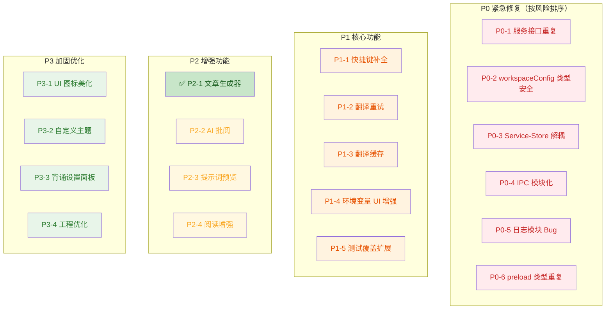

# TSBook2 v1.4 开发路线图

> 按轻重缓急排序 | 当前版本: v1.3 | 最后更新: 2026-06-27

---

## P0 — 紧急修复（Bug & 数据安全）

> 影响功能正常运行或可能导致数据丢失，必须优先解决。
> **排序依据**：按实际运行时风险从高到低排列。

### P0-1 🔴 服务接口重复定义

**问题**：`RecitationService` 接口在 [services/types.ts](file:///g:/program/TSBook2/src/services/types.ts#L68) 和 [services/recitationService.ts](file:///g:/program/TSBook2/src/services/recitationService.ts#L3) 中重复定义，且内容不同步。

**影响分析**：v1.4 正在新增 `createBook`、`renameBook`、`exportBook`、`batchDeleteWords` 等方法，双接口极易产生定义漂移，直接导致运行时错误。

- [x] 统一接口定义到 `services/types.ts`，删除 `recitationService.ts` 中的重复接口
- [x] 确保所有 v1.4 新增方法在单一接口中完整定义
- [x] 确认 `services/index.ts` 的导出正确（已从 `./types` 导出，无需修改）

### P0-2 🔴 `workspaceConfigStore` 类型安全

**问题**：[workspaceConfigStore.ts](file:///g:/program/TSBook2/src/store/workspaceConfigStore.ts#L16,L29) 中使用 `as any` 调用 `getWorkspaceConfig` / `setWorkspaceConfig`，但 `Window.electronAPI` 类型声明中未包含这两个方法。

**影响分析**：`as any` 完全绕过了 TypeScript 类型检查。若 `preload.ts` 或 `main.ts` 中对应 handler 签名变更，无任何编译期告警，属于静默运行时失败风险。

- [x] 在 [types/notebook.ts](file:///g:/program/TSBook2/src/types/notebook.ts#L226-L227) 的 `Window.electronAPI` 类型中补充 `getWorkspaceConfig` 和 `setWorkspaceConfig` 方法签名
- [x] 移除 `workspaceConfigStore.ts` 中的 `as any` 断言
- [x] 确认 `preload.ts` 中暴露的方法名与类型签名一致

### P0-3 🔴 架构加固：Service-Store 解耦

**问题**：[translationService.ts](file:///g:/program/TSBook2/src/services/translationService.ts#L5-L6) 直接 import Zustand store 的 `getState()`，服务层与状态管理层强耦合，导致：
- 服务层无法脱离 React 环境独立测试（阻塞 P1-5 测试覆盖）
- 违背分层依赖原则（Service 不应直接依赖 Store 实现）

- [ ] 将 `useNotebookStore` 和 `useSettingStore` 的访问改为依赖注入模式
- [ ] Services 层构造函数接收 `getNotebookState`, `getSettingState` 等函数参数
- [ ] 确保翻译服务可脱离 React 环境独立测试

### P0-4 🔴 架构加固：IPC Handler 模块化

**问题**：[main.ts](file:///g:/program/TSBook2/electron/main.ts#L157-L535) 中 50+ 个 IPC handler 全部内联在一个函数中，导致：
- 单一文件职责过重，难以维护
- 无法单独测试每个模块的 IPC handler（阻塞 P1-5 测试覆盖）
- 不同领域（文件操作、对话框、背诵、工作区配置）的 handler 混在一起
- 随 v1.4 新增 handler（如 `append-file`）将进一步加重此问题

- [x] 将文件操作 handler 抽取到 `electron/handlers/fileHandlers.ts`
- [x] 将对话框 handler 抽取到 `electron/handlers/dialogHandlers.ts`
- [x] 将背诵模式 handler 抽取到 `electron/handlers/recitationHandlers.ts`
- [x] 将工作区配置 handler 抽取到 `electron/handlers/workspaceConfigHandlers.ts`
- [x] 将设置 handler 抽取到 `electron/handlers/settingsHandlers.ts`
- [x] 创建 `electron/state.ts` 共享状态模块
- [x] `main.ts` 从 548 行精简至 66 行，仅做注册编排

### P0-5 🔴 日志模块 Bug 修复

**问题**：日志模块（`outputStore` + `logService`）存在多个问题，经代码验证后实际影响有所修正。

- [x] **问题 1**：`logService.appendToFile` 基于队列 + IPC 的"先读后写"模式，实现复杂且性能低

  **修复**：新增 `append-file` IPC handler（`fs.appendFileSync`），`appendToFile` 从 3 次 IPC + 30 行队列简化为 1 次 IPC 调用。

- [x] **问题 2**：`outputStore.addLog` 在模块顶层创建 `_logService`，此时 `workspacePath` 可能为 null

  **修复**：`_logService` 改为惰性初始化 getter，首次 `addLog` 调用时创建。

- [x] **问题 3**：日志文件按日期命名（`yyyy-MM-dd.log`），跨天运行时可能产生巨量文件，缺乏清理机制
  **影响**：长期使用会在 `.TransRead/log/` 目录积累大量日志文件（确认属实）。
  **修复**：增加 `cleanupOldLogs(retentionDays=30)`，启动时自动清理过期日志。

### P0-6 🔴 `preload.ts` 与 `types/electron.ts` 类型重复

**问题**：`FileEntry`、`DirEntry`、`ImportResult` 三个类型在 [preload.ts](file:///g:/program/TSBook2/electron/preload.ts#L3-L19) 和 [types/electron.ts](file:///g:/program/TSBook2/src/types/electron.ts#L1-L16) 中完全重复定义。

**影响分析**：低运行时风险——当前两份定义内容一致，改一处时需手动同步另一处，否则编译报错。属于代码维护负担而非运行时缺陷。

- [x] 删除 `preload.ts` 中的内联类型定义
- [x] 改为从 `electron/types.ts` 共享类型文件 import

---

## 问题关联性分析

> 以下分析揭示了 P0-P3 各问题之间的依赖关系和影响路径，帮助制定合理的实施顺序。

### 强依赖（必须先完成前置项）

| 前置问题 | 阻塞的问题 | 原因 |
|---------|-----------|------|
| P0-3 架构加固：Service-Store 解耦 | P1-5 测试覆盖（服务层测试） | 服务直接依赖 Zustand store，脱离 React 无法运行 |
| P0-4 架构加固：IPC Handler 模块化 | P1-5 测试覆盖（IPC handler 测试） | Handler 全部内联在 main.ts 中，无法单独实例化测试 |
| P0-4 架构加固：IPC Handler 模块化 | P0-5 问题 1（日志追加写入） | `append-file` handler 应作为文件 handler 模块的一部分实现 |
| P0-2 类型安全（electronAPI 类型补齐） | P0-5 问题 2（日志初始化） | `appendToFile` 在 electronAPI 上新增时需要对应类型声明 |

### 弱关联（共享组件或模式，但不阻塞）

| 关联问题 | 关联关系 |
|---------|---------|
| P0-1 服务接口重复 → P0-4 IPC Handler 模块化 | 两者都涉及背诵（recitation）模块的边界划分，可一并规划 |
| P0-5 日志问题 3（清理机制） ↔ P2-4 阅读计时器持久化 | 阅读计时数据可能复用日志写入机制，清理策略需协调 |
| P0-3 Service-Store 解耦 ↔ P0-4 IPC Handler 模块化 | 同属架构加固主题，Service 边界和 IPC 边界应统一设计 |
| P0-3 Service-Store 解耦 ↔ P1-3 翻译缓存 | 翻译缓存的实现需要干净的 Service 接口，耦合的 Service 会使缓存接入更复杂 |
| P0-4 IPC Handler 模块化 → P3-2 自定义主题 | 自定义主题持久化通过 `workspace-config` handler 实现，已模块化后可轻松扩展现有 handler |
| P1-2 翻译重试 ↔ P1-3 翻译缓存 | 两者都涉及 translationService 的扩展，重试逻辑应考虑缓存命中后的跳过策略 |
| P2-2 AI 批阅 ↔ P1-4 环境变量配置 | AI 批阅功能需要独立的 API Key/Endpoint 配置，可复用 P1-4 的环境变量 UI 组件 |

### 合并建议

| 建议 | 涉及问题 | 理由 |
|------|---------|------|
| **批量修复** | P0-1 接口重复 + P0-4 IPC 模块化 | 背诵模块的 interface 抽取和 IPC 抽取可一次完成 |
| **批量修复** | P0-2 类型安全 + P0-6 类型重复 | 同属类型加固，修改同一组文件（types/notebook.ts、preload.ts） |
| **前置条件** | P0-3 Service-Store 解耦 → P1-5 测试覆盖 | 先解除耦合再编写测试，否则测试无法运行 |
| **前置条件** | P0-4 IPC 模块化 → P0-5 问题 1 | 日志追加写入 handler 可以作为文件 handler 模块的一部分实现 |

### 推荐实施顺序

```
第一阶段（P0 架构加固 → 扫清测试障碍）
  ├─ Day 1: P0-1 服务接口合并 + P0-2 类型安全 + P0-6 类型重复清理（同属类型修正）
  ├─ Day 2-3: P0-3 Service-Store 解耦（为测试铺路）
  ├─ Day 4-5: P0-4 IPC 模块化（含 append-file handler，同时解决 P0-5 问题 1）
  └─ Day 6: P0-5 问题 2-3（日志延迟初始化 + 清理机制）

第二阶段（P1 核心功能 → 搭配测试）
  ├─ P1-1 快捷键补全
  ├─ P1-4 环境变量 UI 增强
  ├─ P1-2 翻译重试 + P1-3 翻译缓存（共享 translationService 扩展）
  └─ P1-5 测试覆盖扩展（此时 P0-3/P0-4 已解耦，可独立测试）

第三阶段（P2-P3 增强功能）
  ├─ P2-1 文章生成器（已完成）
  ├─ P2-2 AI 批阅 + P2-3 提示词预览
  ├─ P2-4 阅读增强
  └─ P3-1~P3-4 持续优化
```

## P1 — 高优先级（核心功能完善）

> 影响用户日常使用体验，属于核心工作流的必要功能。

### P1-1 🟠 快捷键补全

**现状**：`useKeyboard` 已注册单元格操作快捷键，但文件操作和翻译快捷键缺失。

- [ ] `Ctrl+Shift+S` — 另存为（`fileService.saveFileAs()`）
- [ ] `Ctrl+O` — 打开文件（`fileService.openFile()`）
- [ ] `Ctrl+Shift+I` — 导入文本文件（`fileService.importText()`）
- [ ] `Ctrl+Enter` — 翻译当前选中单元格
- [ ] `Ctrl+Shift+Enter` — 翻译全部单元格
- [ ] `Ctrl+B` — 切换侧边栏显示
- [ ] `Ctrl+J` — 切换底部面板显示

**注意**：需要避免与 TipTap 编辑器原生快捷键冲突。

### P1-2 🟠 翻译错误重试机制

**现状**：翻译失败后仅显示错误状态，用户无法手动重试。

- [ ] 在 `CellToolbar` 上为 `error` 状态的单元格显示"重试"按钮
- [ ] 在 `Panel` 底部面板的翻译进度区域添加"重试全部失败"按钮
- [ ] `translationService` 增加 `retryCell(index)` 和 `retryAllFailed()` 方法
- [ ] 支持自动重试配置（最大重试次数、重试间隔）

### P1-3 🟠 翻译缓存

**现状**：相同原文切换文件后重新翻译，浪费 API 配额和时间。

- [ ] 设计缓存结构：`Map<contentHash, { output, timestamp, providerId }>`
- [ ] 缓存存储位置：内存缓存（会话级） + 可选的磁盘缓存（持久化）
- [ ] 缓存失效策略：提供者切换时清空、手动清除、按时间过期
- [ ] `CellToolbar` 中标记缓存命中的单元格

### P1-4 🟠 环境变量配置 UI 增强

**现状**：`SettingsDialog` 已支持 `EnvVars` 的添加/编辑/删除，但缺少校验和可见性控制。

- [ ] 在自定义模型编辑界面增加"测试连接"按钮（复用 `TranslationService.testConnection`）
- [ ] API Key 输入框支持密码模式（`type="password"`）切换显示/隐藏
- [ ] 环境变量编辑时校验变量名合法性（不允许特殊字符）
- [ ] 环境变量配置联动：修改后自动刷新 TranslationProvider

### P1-5 🟠 测试覆盖扩展

**现状**：仅有 3 个测试文件（notebookStore / themeStore / fileUtils），服务层、IPC handler、核心组件均缺少测试。

- [ ] **服务层测试**：translationService 翻译流程测试、recitationService IPC 代理测试
- [ ] **Store 测试**：recitationStore（答题/选择/同步逻辑）、outputStore、settingStore
- [ ] **工具函数测试**：articleUtils、ebbinghaus 算法
- [ ] **组件测试**：CellContainer（选中/编辑/折叠）、BookCard、QuizPanel
- [ ] **E2E 测试**：文件打开/保存/导入完整流程

---

## P2 — 中优先级（增强功能）

> 提升用户体验，但不是核心工作流的必需功能。

### P2-1 🟢✅ 文章生成器集成（已完成）

**现状**：已在 `BookManagerPanel` 中完整实现，包含 UI 入口、AI 调用、文件保存全流程。

- [x] **UI 按钮**：[BookManagerPanel.tsx#L625-L640](file:///g:/program/TSBook2/src/components/recitation/BookManagerPanel.tsx#L625-L640) — `bookManager.generateArticle` 按钮
- [x] **完整逻辑**：[BookManagerPanel.tsx#L295-L401](file:///g:/program/TSBook2/src/components/recitation/BookManagerPanel.tsx#L295-L401) — `handleGenerateArticle` 读取选中单词 → 调 AI → 处理文章 → 保存文件 → 打开编辑器
- [x] **文章处理**：[articleUtils.ts](file:///g:/program/TSBook2/src/utils/articleUtils.ts) — `processArticleText` 单词形态变化匹配、**加粗**新词 / `<u>`下划线`</u>` 复习词、标题提取
- [x] **服务接口**：[translationService.ts#L211](file:///g:/program/TSBook2/src/services/translationService.ts#L211) — `generateSceneText` 方法
- [x] **文件命名**：`{词书名}-{文章标题}.transnb`，保存到 `{workspace}/{YYYYMMDD}/` 子目录
- [x] **错误处理**：完整异常捕获 + `outputStore.addLog` 彩色日志反馈
- [x] **加载状态**：生成中显示 `bookManager.generating` 提示文字
- [x] **国际化**：`zh-CN.json` 和 `en-US.json` 均已配置翻译键

> ⚠️ 后续可考虑增强：支持选择提示词模板（当前固定使用 `scenery` 模板）。

### P2-2 🟡 AI 批阅功能

**现状**：用户可手写文章模拟考试写作，但无 AI 批改能力。

- [ ] **需求定义**：用户在当前打开的 `.transnb` 文件中编写文章，选中后请求 AI 批改
- [ ] **批改内容**：语法检查、句子优化、用词建议、评分
- [ ] **输出形式**：批改结果输出到新的 Cell 中（或底部 Panel 中展示）
- [ ] **接口设计**：新增 `TranslationService.reviewWriting(text)` 方法，使用独立提示词模板
- [ ] **设置面板**：新增"写作批改"提示词模板配置项

### P2-3 🟡 提示词模板变量替换预览

**现状**：用户编辑提示词模板时无法预览 `{input}` 占位符替换效果。

- [ ] 在 `SettingsDialog` 的 Prompts 标签页中添加实时预览区域
- [ ] 用户输入示例文本后，实时展示模板替换结果
- [ ] 支持所有模板（translation / analysis / scenery）的预览

### P2-4 🟡 阅读功能增强

- [ ] **阅读计时器数据持久化**：将历史计时记录保存到日志，支持查看当日/当周阅读总时长
- [ ] **阅读计时器统计**：在底部 Panel 或 StatusBar 显示当日累计阅读时间
- [ ] **自动暂停**：窗口失焦时自动暂停计时

---

## P3 — 低优先级（加固与优化）

> 提升代码质量、可维护性和 UI 细节，适合在功能迭代间隙处理。

### P3-1 🟢 UI 图标美化

**现状**：ActivityBar 和 FileExplorer 使用文本/简单字符作为图标。

- [ ] 替换 ActivityBar 图标为 SVG（文件探索、搜索、设置、背诵）
- [ ] 替换 FileExplorer 中的文件夹/文件图标为 SVG
- [ ] 替换 CellToolbar 按钮图标为 SVG
- [ ] 统一图标风格（尺寸 16px/20px，颜色继承当前 foreground）

### P3-2 🟢 用户自定义主题

**现状**：只支持 light/dark 两套内置主题，用户无法自定义。

- [ ] `settingStore` 新增 `customTheme: Partial<ThemeConfig> | null` 字段
- [ ] `themeStore` 支持合并自定义主题覆盖（`{ ...themes[base], ...customTheme }`）
- [ ] `SettingsDialog` 新增 "Appearance" 标签页
- [ ] 颜色选择器支持修改关键色：背景色、前景色、编辑器背景色、主色调
- [ ] 自定义主题持久化到 `settings.json`

### P3-3 🟢 背诵设置面板（SettingsDialog 集成）

**现状**：每日新词数/复习数的 UI 和持久化已在 `BookManagerPanel` 工具栏中实现，但缺少集中的设置面板入口。

#### ✅ 已完成
- [x] **UI 输入框**：[BookManagerPanel.tsx#L663-L712](file:///g:/program/TSBook2/src/components/recitation/BookManagerPanel.tsx#L663-L712) — 工具栏右侧的 `每日新学` / `每日复习` 数字输入框
- [x] **即时持久化**：通过 `recitationService.setConfig('daily_new_words', ...)` / `setConfig('daily_review_words', ...)` 写入 `studywordmode.json`
- [x] **加载回显**：`loadBooks()` 时通过 `recitationService.getConfig()` 读取配置并恢复值
- [x] **国际化**：`bookManager.dailyNew` / `bookManager.review` 翻译键

#### 📋 仍待补充
- [ ] 在 `SettingsDialog` 中新增 "Recitation" 标签页（集成管理以上配置，同时提供额外的配置入口）
- [ ] 新增配置项：检测选项数（默认 4）、悬浮动画开关
- [ ] 新增配置项：词书导入默认路径、导出路径

### P3-4 🟢 工程优化

- [ ] **编译优化**：检查 TypeScript 编译配置，减少编译时间
- [ ] **包体积优化**：分析 `electron-builder` 打包大小，减少不必要的依赖
- [ ] **Vite 配置优化**：启用代码分割、Tree-shaking 优化
- [ ] **ESLint 规则补充**：增加 `no-as-any`、`no-unused-vars` 等规则

---

## 优先级矩阵总览



---

## 建议实施路线（已关联依赖关系）

> 此路线与上方"问题关联性分析"中的推荐实施顺序保持一致，更新为按新 P0 排序。

### 第一阶段（P0 架构加固）— 预计 1 周

```
第 1 天:   P0-1 服务接口合并 + P0-2 类型安全 + P0-6 类型重复清理（同属类型修正）
第 2-3 天: P0-3 Service-Store 解耦（为测试铺路）
第 4-5 天: P0-4 IPC 模块化（含 append-file handler，同时解决 P0-5 问题 1）
第 6 天:   P0-5 问题 2-3（日志延迟初始化 + 清理机制）
```

### 第二阶段（P1 核心功能 + 测试）— 预计 1 周

```
第 7 天:   P1-1 快捷键补全
第 8 天:   P1-4 环境变量 UI 增强
第 9-10 天: P1-2 翻译重试 + P1-3 翻译缓存（共享 translationService 扩展）
第 11 天:  P1-5 测试覆盖扩展（此时 P0-3/P0-4 已解耦，可独立测试）
```

### 第三阶段（P2-P3 增强功能）— 预计 2-3 周

```
P2-2 AI 批阅 + P2-3 提示词预览
P2-4 阅读增强
P3-1 UI 图标美化
P3-2 自定义主题 + P3-3 背诵设置面板
P3-4 工程优化
```
